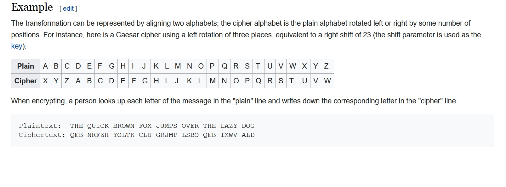
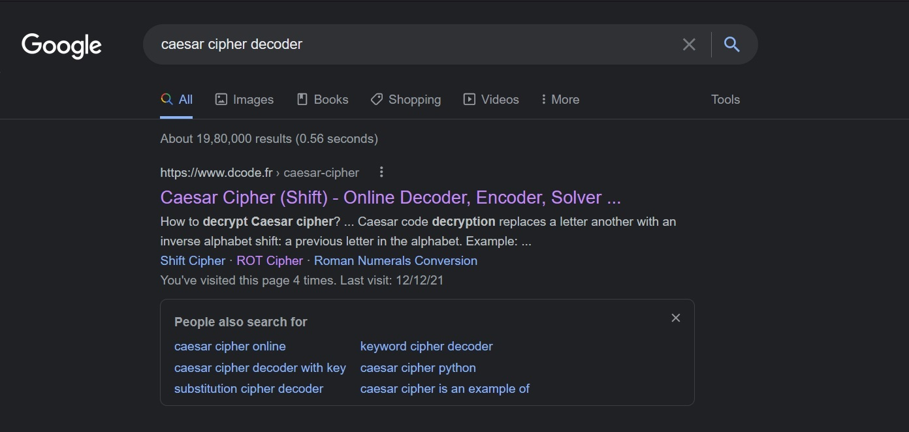

# Tutorial - Rotting Fruits

This was the easist challenge in the Crypto category, if you take a look at the description you can see it is written this might help, when you click on the link it takes you to wikipedia page with a so called "caeser cipher".

We google caeser cipher decoder we get -

The first one we get is https://www.dcode.fr/caesar-cipher now, we input the encrypted flag "vqrx{ebg13_vf_xvaqn_xrjy_aty}" and we get -

# Flag - idek{rot13_is_kinda_kewl_ngl}
